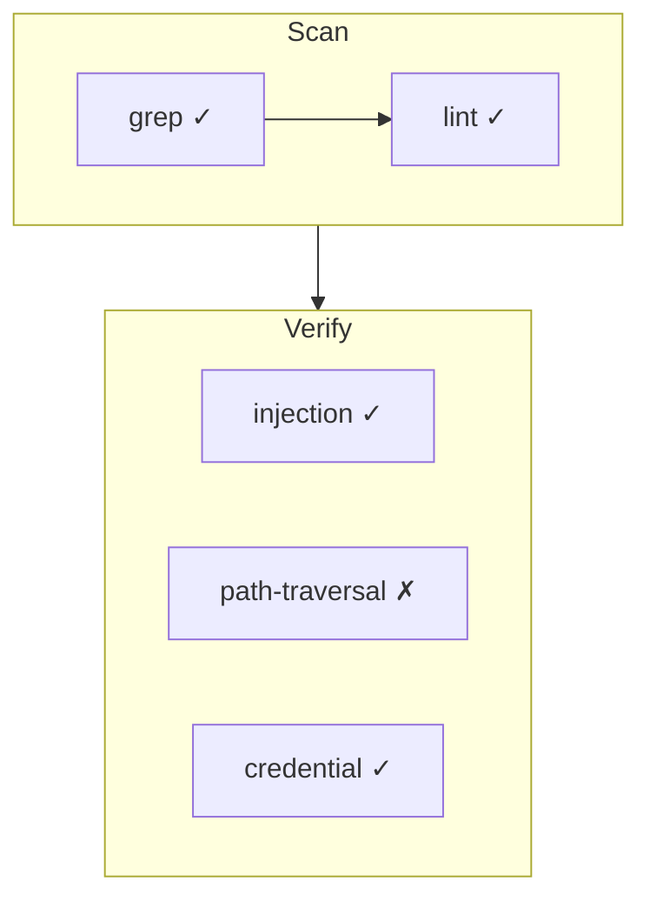

# Workflow 可视化 — Design Spec

> **日期**: 2026-08-07
> **方案**: EventEmitter + Journal 混合（方案 2）
> **目标**: CLI 实时进度 + Web Dashboard DAG 分析

---

## 一、架构概览

```
┌─────────────────────────────────────────────────────────────┐
│ Workflow 执行 (runtime.ts)                                  │
│   phase('Scan')  agent('grep...')  agent('analyze...')     │
│        │               │                │                   │
│        ▼               ▼                ▼                   │
│  ┌──────────────────────────────────────────┐               │
│  │        WorkflowEventBus (EventEmitter)     │               │
│  │  events: phase:start/end, agent:start/end │               │
│  │          agent:result, log, error, done    │               │
│  └──────┬──────────────┬─────────────────────┘               │
│         │              │                                     │
│         ▼              ▼                                     │
│  ┌───────────┐  ┌──────────────────────┐                     │
│  │ CLI Ink    │  │ journal.jsonl        │                     │
│  │ Workflow   │  │ (已有，不改)          │                     │
│  │ Progress   │  └──────────┬───────────┘                     │
│  │ Component  │             │                                 │
│  └───────────┘             ▼                                 │
│                   ┌──────────────────────┐                    │
│                   │ Web Dashboard         │                    │
│                   │ /code/dashboard       │                    │
│                   │ Mermaid DAG + Stats   │                    │
│                   └──────────────────────┘                    │
└─────────────────────────────────────────────────────────────┘
```

**核心原则**:

- EventBus 零侵入现有 API（agent/phase/log 签名不变）
- journal.jsonl 保持不变，Web 端纯文件读取
- CLI 组件可选开启（`/workflow watch <id>` 或自动检测）

---

## 二、组件设计

### 2.1 WorkflowEventBus (`apps/cli/src/workflow/event-bus.ts`)

```typescript
// 事件类型
type WorkflowEvent =
  | { type: 'phase:start'; phase: string; timestamp: number }
  | { type: 'phase:end'; phase: string; timestamp: number }
  | { type: 'agent:start'; agentId: string; label: string; phase: string }
  | { type: 'agent:end'; agentId: string; label: string; success: boolean; durationMs: number }
  | { type: 'agent:result'; agentId: string; summary: string }
  | { type: 'log'; message: string }
  | { type: 'error'; agentId?: string; message: string }
  | { type: 'done'; runId: string; totalAgents: number; cacheHits: number }

// 单例 EventEmitter
class WorkflowEventBus extends EventEmitter {
  private activeRunId: string | null
  startRun(runId: string): void
  emitEvent(event: WorkflowEvent): void
  getActiveRunId(): string | null
}
```

### 2.2 CLI 组件 (`apps/cli/src/ui/workflow-progress.tsx`)

```
Ink 组件渲染示意：

  ═══════════════════════════════════════════
   Workflow: audit-codebase (wf_abc123)
  ═══════════════════════════════════════════

   Phase: Review          [2/3 agents done]
   ● code-reviewer:grep       ✓ 1.2s
   ● code-reviewer:lint       ✓ 0.8s
   ◌ code-reviewer:security   ⏳ running...

   Phase: Verify (pending)
   ○ verify:injection
   ○ verify:path-traversal
   ○ verify:credential

   ═══════════════════════════════════════════
   Elapsed: 4.3s | Agents: 2/6 | Status: running
```

### 2.3 Web Dashboard (`apps/web/src/app/code/dashboard/`)

- **工作流列表**: 读取 `~/.mipham/workflows/` 目录，按时间排序
- **DAG 视图**: Mermaid.js 渲染流程图（phase 分组 → agent 节点 → 状态着色）
- **统计面板**: 总 agent 数、成功率、缓存命中率、总耗时

Mermaid 生成示例：



---

## 三、数据流

```
1. runtime.ts: startRun() → EventBus.emit('phase:start', ...)
2. runtime.ts: agent() wrapper → EventBus.emit('agent:start', ...)
3. 同时写 journal.jsonl（已有逻辑，不变）
4. EventBus → CLI WorkflowProgress 组件 (Ink useEventBus hook)
5. 执行结束 → EventBus.emit('done', ...)
6. Web Dashboard: GET /api/workflows → 读 journal 文件 → 返回 JSON
                 GET /api/workflows/:id → 读单个 journal → 返回 DAG 数据
```

---

## 四、文件清单

| 层   | 文件                                | 操作                          | 行数 |
| ---- | ----------------------------------- | ----------------------------- | ---- |
| Core | `workflow/event-bus.ts`             | CREATE                        | ~50  |
| Core | `workflow/runtime.ts`               | MODIFY (注入 EventBus)        | +15  |
| CLI  | `ui/workflow-progress.tsx`          | CREATE                        | ~150 |
| CLI  | `ui/commands.ts`                    | MODIFY (注册 /workflow watch) | +10  |
| CLI  | `ui/commands/workflow-view.ts`      | CREATE                        | ~80  |
| CLI  | `test/ui/workflow-progress.test.ts` | CREATE                        | ~30  |
| CLI  | `test/workflow/event-bus.test.ts`   | CREATE                        | ~25  |
| Web  | `app/code/dashboard/page.tsx`       | MODIFY                        | ~120 |
| Web  | `app/api/workflows/route.ts`        | CREATE                        | ~40  |
| Web  | `app/api/workflows/[id]/route.ts`   | CREATE                        | ~30  |

---

## 五、测试策略

- **event-bus.test.ts**: 事件发射/监听、多订阅者、runId 隔离
- **workflow-progress.test.ts**: 组件渲染各状态（running/completed/failed）
- **现有 workflow 测试**: +2 tests 验证 EventBus 集成不破坏现有行为
- **Web API 测试**: 手动验证（Next.js API routes 暂无测试框架）

---

## 六、约束与取舍

- **不引入新依赖**: EventEmitter 用 Node.js 内置；Web 用 Mermaid CDN
- **CLI 自动检测**: 当 EventBus 有活跃 run 时，app.tsx 自动显示 WorkflowProgress
- **Web 本地文件**: Dashboard API 直接读 `~/.mipham/workflows/`（无数据库）
- **不做 WebSocket**: 保持简单，Web 端刷新即可看最新状态
